# Instrukcja administratora serwisu szkolenia.iskt.pl

Ta instrukcja prowadzi krok po kroku przez czynności dostępne w panelu pod adresem `/panel`. Powstała po przejściu panelu na lokalnym środowisku z fikcyjnymi danymi `[DEMO]`. Widoki mogą zawierać publiczny nagłówek i stopkę serwisu — właściwa nawigacja panelu zaczyna się od pozycji **Pulpit**, **Szkolenia**, **Trenerzy** i **Zgłoszenia**.

## 1. Logowanie

1. Otwórz adres serwisu zakończony `/panel`.
2. Jeśli nie masz aktywnej sesji, panel sam przeniesie Cię do formularza logowania.
3. Wpisz służbowy adres e-mail administratora i hasło przekazane przez osobę opiekującą się dostępem.
4. Wybierz **Zaloguj się**. Po poprawnym logowaniu zobaczysz pulpit oraz nawigację panelu.

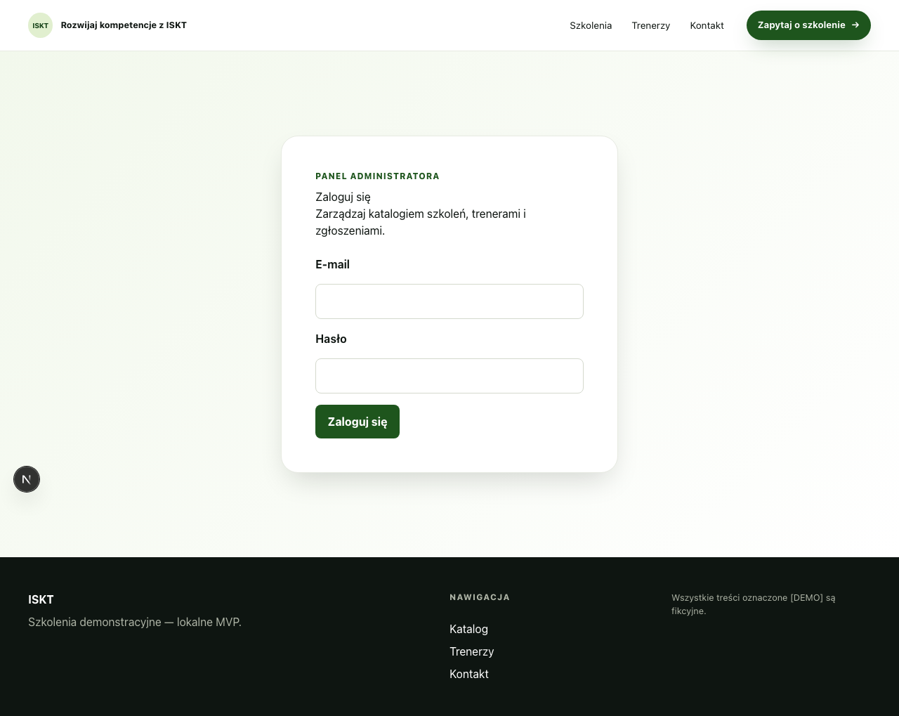

Jeśli pojawi się komunikat „Nie udało się zalogować”, sprawdź adres i hasło. Po nieudanej próbie pole e-mail może zostać wyczyszczone — wpisz ponownie oba pola. Jeśli kolejna próba nie reaguje, odśwież stronę i spróbuj jeszcze raz. Nie wysyłaj hasła e-mailem ani komunikatorem. Gdy dostęp nadal nie działa, poproś opiekuna technicznego o sprawdzenie konta administratora.

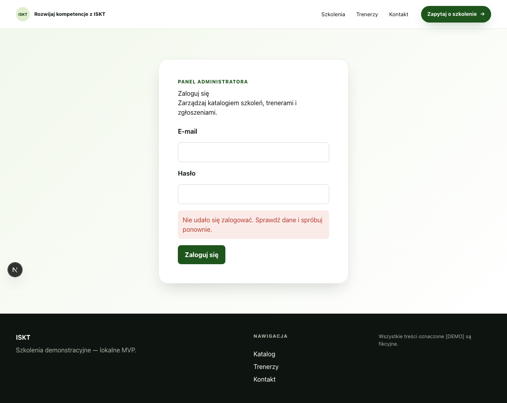

Po zakończeniu pracy wybierz **Wyloguj**. Jest to szczególnie ważne na współdzielonym komputerze.

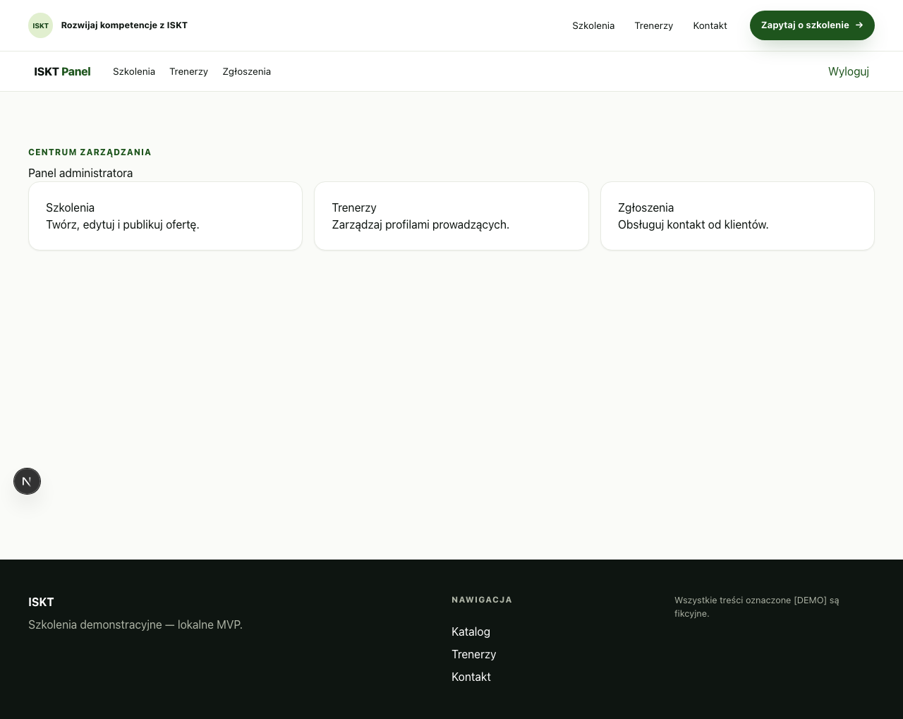

## 2. Trenerzy

Warto zacząć od trenerów, aby można ich było od razu przypisać do szkolenia.

### Dodanie trenera

1. Wejdź w **Trenerzy** i wybierz **Dodaj trenera**.
2. Uzupełnij imię i nazwisko.
3. Uzupełnij pole **Slug** krótkim adresem bez spacji i polskich znaków, np. `anna-kowalska`. To fragment adresu internetowego profilu.
4. Dodaj nagłówek, biogram i kompetencje oddzielone przecinkami.
5. Opcjonalnie wklej pełny adres URL zdjęcia, zaczynający się od `https://`. Panel nie przyjmuje plików z komputera.
6. Wybierz **Zapisz trenera**. Nowa osoba pojawi się jako **Szkic**.

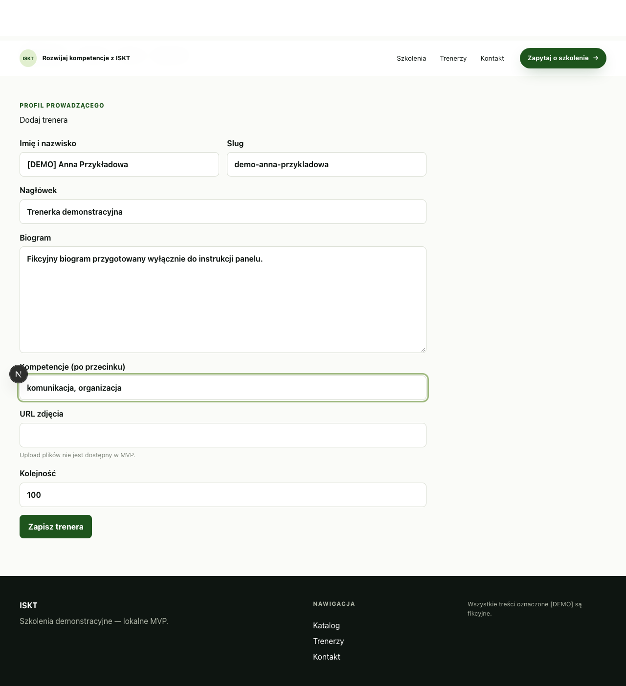

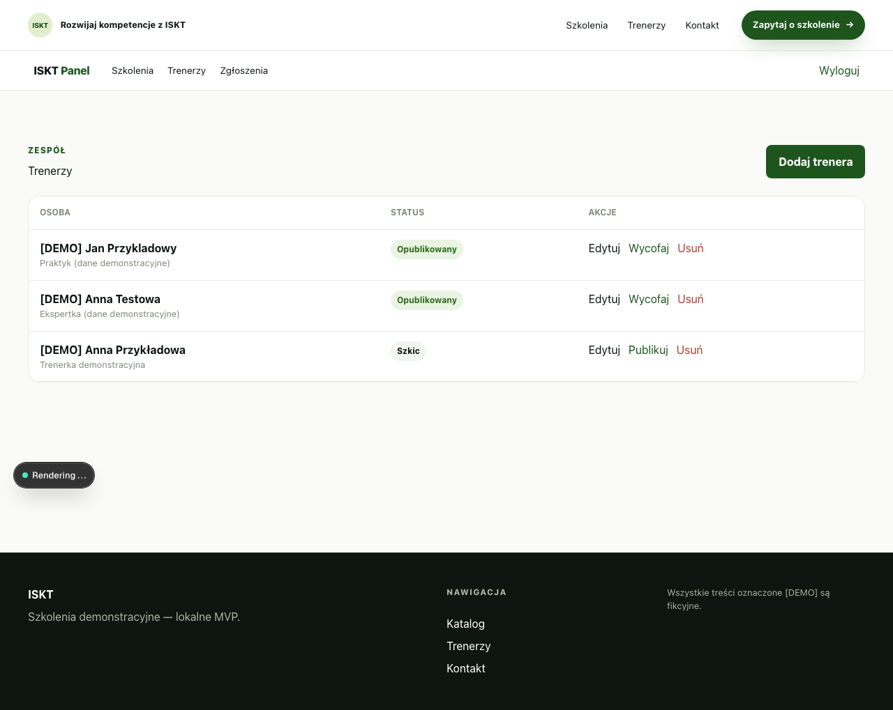

### Edycja i publikacja trenera

Przy wybranej osobie kliknij **Edytuj**, zmień potrzebne dane i ponownie wybierz **Zapisz trenera**. Aby profil był widoczny dla odwiedzających, na liście wybierz **Publikuj**. Przycisk zmieni się na **Wycofaj**.

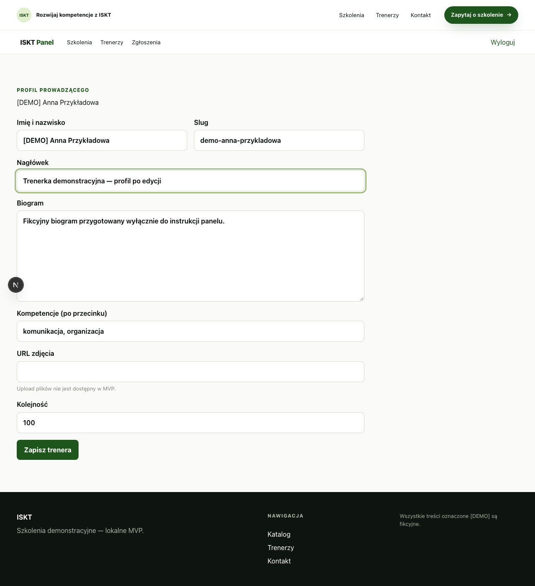

Zdjęcie jest opcjonalne. Bez niego publiczna lista pokazuje tekstowy profil z imieniem, nagłówkiem, biogramem i kompetencjami — nie ma pustego ani uszkodzonego obrazka.

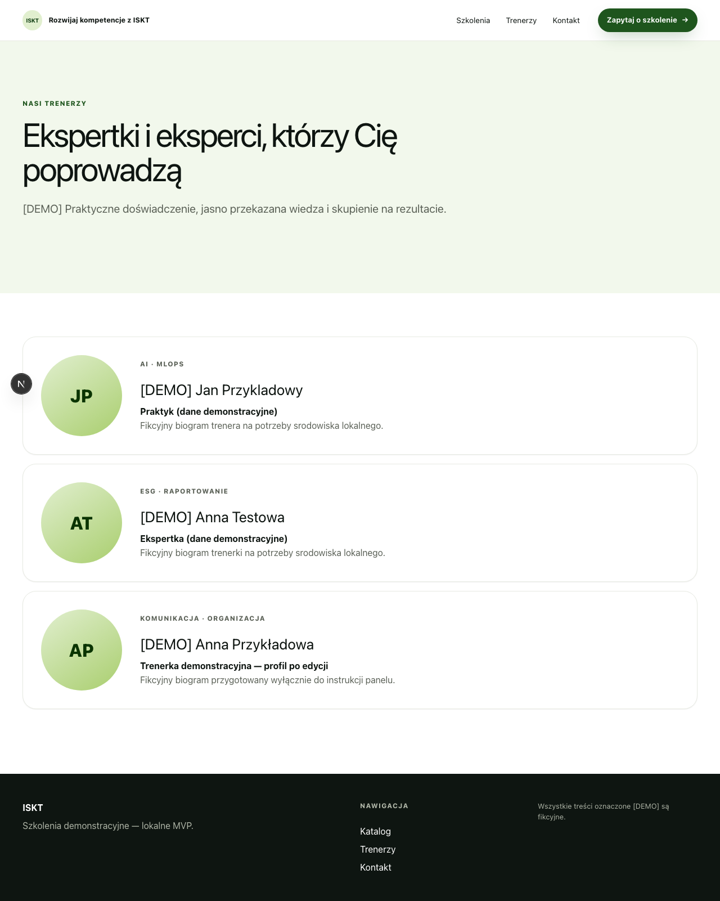

Przed publikacją zdjęcia upewnij się, że ISKT ma prawo do wykorzystania wizerunku oraz samego pliku. Nie używaj przypadkowych zdjęć znalezionych w internecie.

## 3. Szkolenia: dodanie, szkic i edycja

### Dodanie szkolenia

1. Wejdź w **Szkolenia** i wybierz **Dodaj szkolenie**.
2. Podaj tytuł oraz **Slug**, czyli fragment adresu bez spacji i polskich znaków, np. `zarzadzanie-projektem`.
3. Wpisz podsumowanie widoczne na liście oraz dłuższy opis.
4. Wybierz kategorię i poziom.
5. Podaj czas trwania i cenę netto. Możesz dopisać najbliższe terminy i zaznaczyć dostępność dofinansowania.
6. W sekcji **Trenerzy** zaznacz osoby prowadzące. Można wybrać więcej niż jedną.
7. Wybierz **Zapisz szkolenie**.

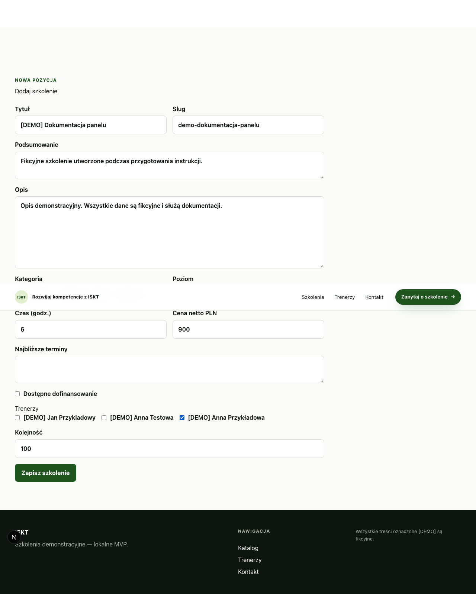

Nowa pozycja zostaje zapisana jako **Szkic**. Dzięki temu możesz dokończyć treść później, a odwiedzający jeszcze jej nie zobaczą.

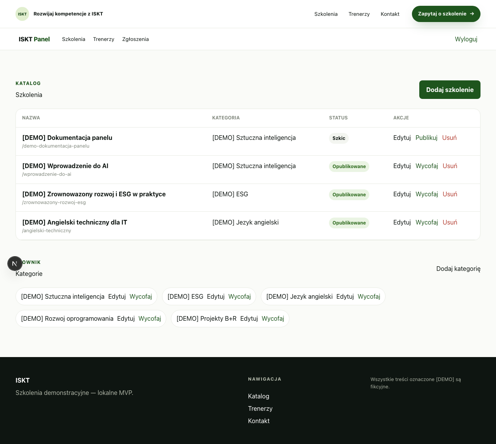

### Edycja szkolenia

Na liście szkoleń kliknij **Edytuj** przy właściwym wierszu. Zmień dane, kategorię lub zaznaczenie trenerów, a następnie wybierz **Zapisz szkolenie**. Panel zachowuje przypisane wcześniej osoby — sprawdź zaznaczenia przed zapisem.

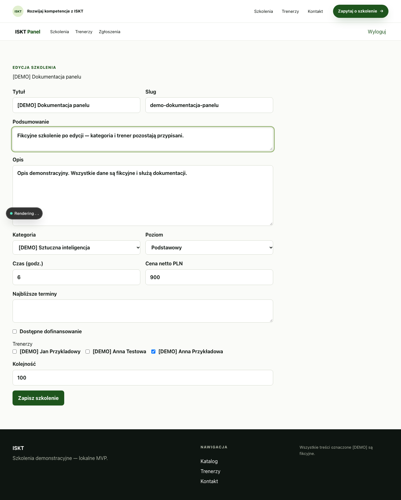

## 4. Publikacja i wycofanie

### Publikacja

Na liście szkoleń wybierz **Publikuj**. Status zmieni się ze **Szkic** na **Opublikowane**.

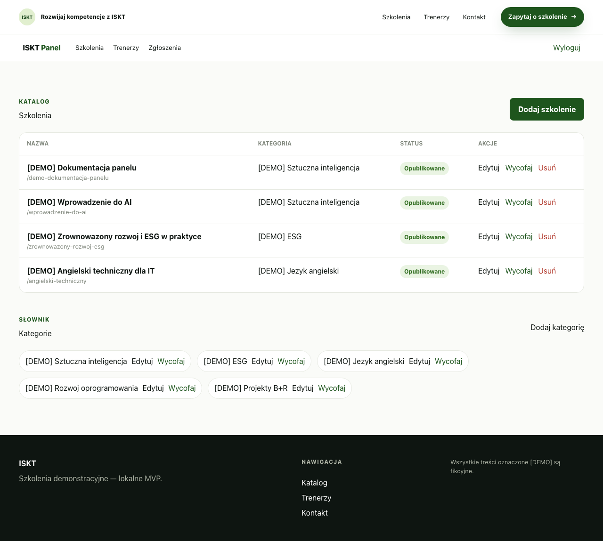

Od tej chwili odwiedzający mogą znaleźć szkolenie w katalogu i otworzyć jego publiczną stronę. Widzą między innymi tytuł, opis, kategorię, poziom, czas, cenę, terminy i przypisanych opublikowanych trenerów.

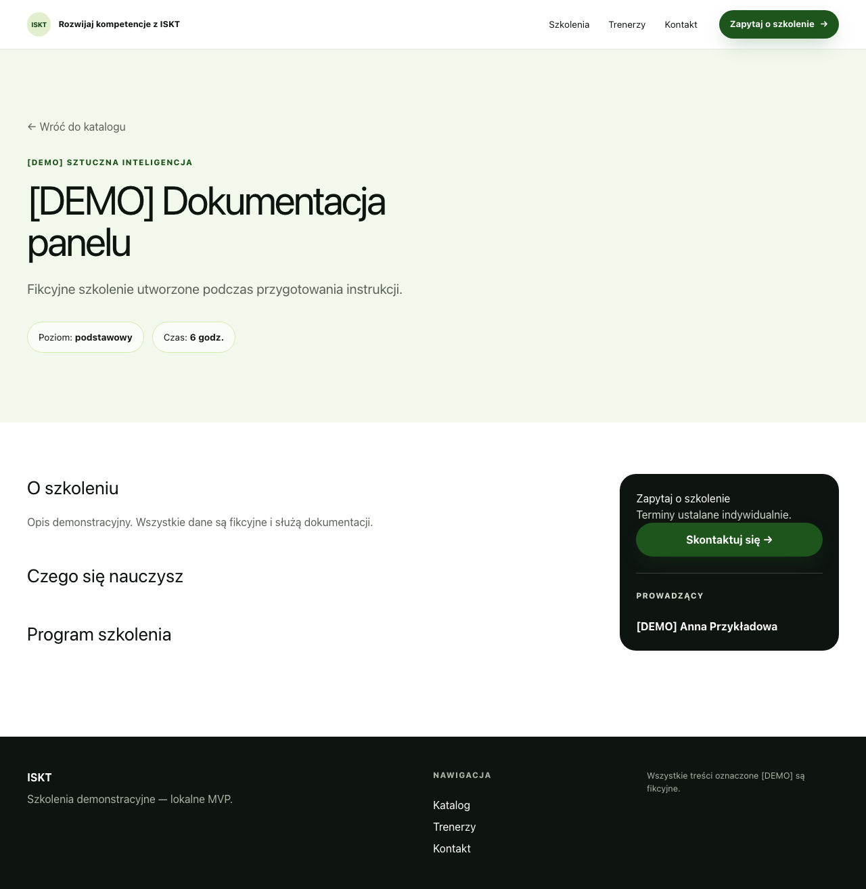

Panel odświeża zapamiętaną wersję katalogu po zmianie. W sprawdzonym przebiegu nowa strona była dostępna po mniej niż sekundzie; przy pierwszym, „zimnym” otwarciu lokalnego serwera trwało to do około 24 sekund. W codziennej pracy po publikacji otwórz publiczną stronę lub ją odśwież. Jeśli zmiana nie pojawi się od razu, odczekaj chwilę i odśwież ponownie. Publiczne strony mają dodatkowe automatyczne odświeżenie co 5 minut.

### Wycofanie

Przy opublikowanym szkoleniu wybierz **Wycofaj**. Status wróci do **Szkic**.

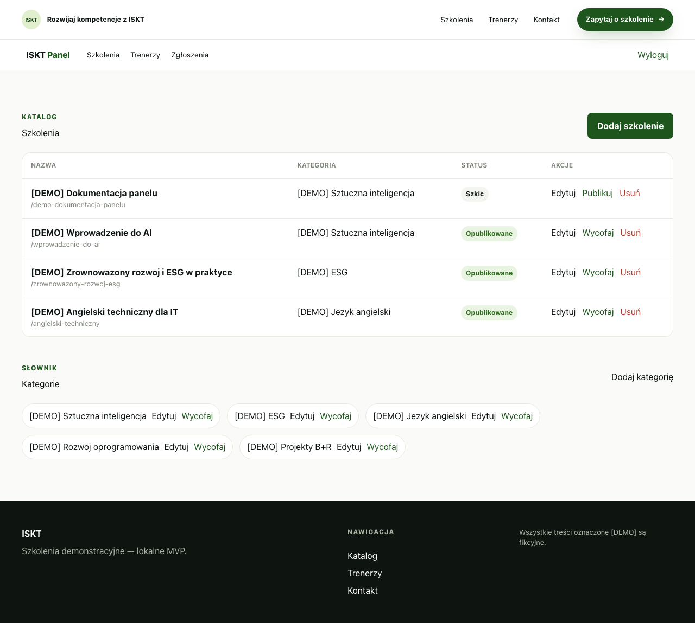

Po wycofaniu pozycja znika z katalogu, a jej dotychczasowy adres pokazuje stronę „Nie znaleziono strony”. W sprawdzonym przebiegu stało się to po mniej niż sekundzie. Osoba, która ma jeszcze starą stronę otwartą w karcie, musi ją odświeżyć.

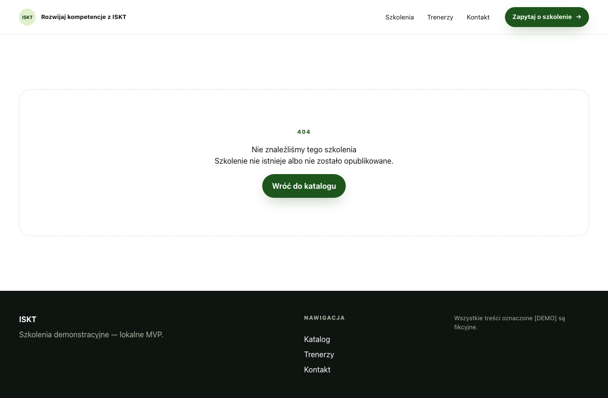

Wycofanie nie usuwa treści. Nadal możesz ją poprawić w panelu i opublikować ponownie. **Usuń** kasuje pozycję — używaj tej funkcji tylko wtedy, gdy treść naprawdę nie będzie już potrzebna.

## 5. Zgłoszenia

Wejdź w **Zgłoszenia**. Lista pokazuje nadawcę, datę, etap obsługi i stan powiadomienia e-mail. W kolumnie **E-mail** zobaczysz między innymi **Wysłano**, **Oczekuje** albo **Błąd wysyłki**.

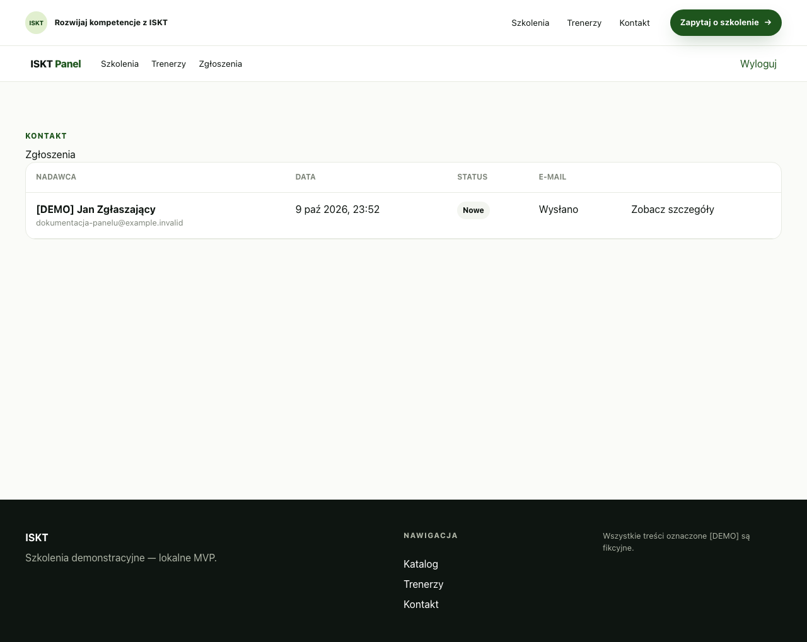

Wybierz **Zobacz szczegóły**, aby przeczytać dane kontaktowe, temat i wiadomość. Osobna karta **Powiadomienie e-mail** potwierdza stan wysyłki, a przy udanej wysyłce także jej czas.

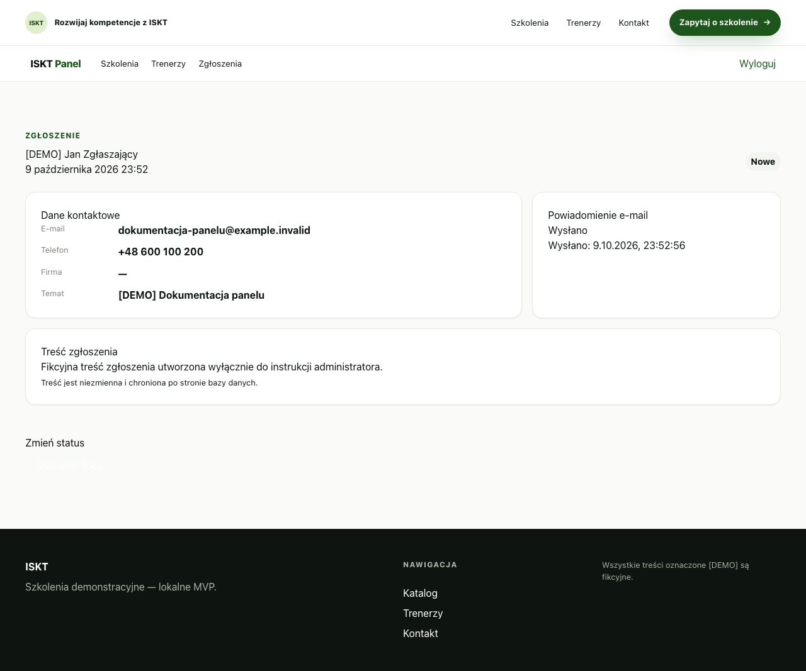

### Cykl obsługi

1. Nowe zgłoszenie ma status **Nowe**.
2. Gdy zaczynasz je obsługiwać, wybierz **Ustaw: W toku**.
3. Po zakończeniu sprawy wybierz **Ustaw: Zamknięte**.

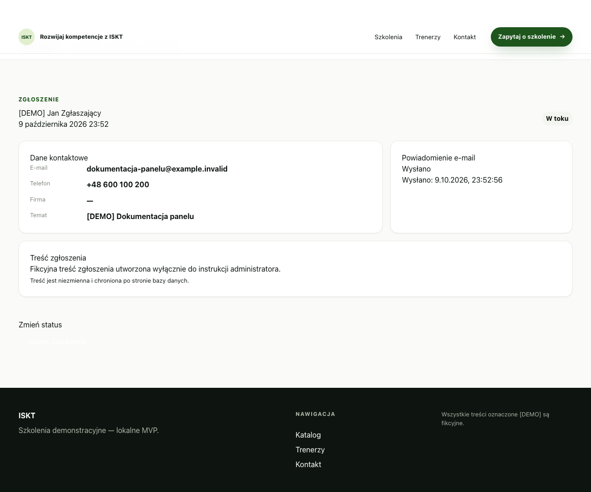

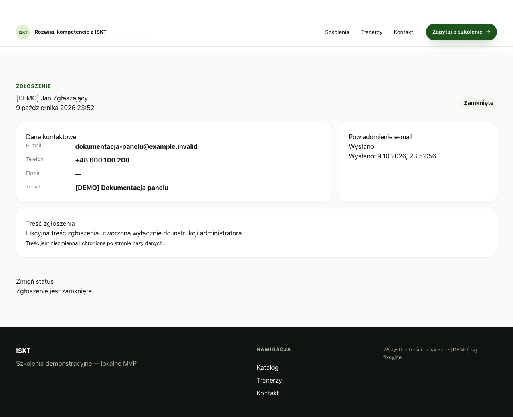

Zamkniętego zgłoszenia nie można cofnąć do wcześniejszego etapu. Treści zgłoszenia nie można edytować na żadnym etapie. To celowe: panel zachowuje dokładnie wiadomość wysłaną przez nadawcę, dzięki czemu historia sprawy pozostaje wiarygodna.

## 6. Dane osobowe w zgłoszeniach

Zgłoszenia zawierają dane osobowe. Stosuj zasady zatwierdzone w bramce zgodności E8:

- przechowuj zgłoszenia przez 12 miesięcy;
- pracuj na nich w panelu;
- nie kopiuj danych do prywatnych notatek, arkuszy ani innych narzędzi poza panelem;
- nie przesyłaj treści zgłoszeń dalej osobom, które nie obsługują danej sprawy.

Ta sekcja jest praktycznym przypomnieniem ustaleń E8, a nie nową poradą prawną.

## 7. Czego panel nie robi

Panel MVP nie obsługuje:

- płatności ani faktur;
- rezerwacji miejsc;
- kont uczestników;
- newslettera;
- wysyłania plików i zdjęć z komputera;
- modułu aktualnych naborów.

Jeśli osoba zainteresowana chce zapisać się lub zapłacić, obsłuż ten krok poza panelem zgodnie z aktualnym procesem ISKT.

## 8. FAQ

### Nie mogę się zalogować. Co zrobić?

Sprawdź oba pola. Po błędzie e-mail może zostać wyczyszczony. Wpisz go ponownie; jeśli ponowna próba nie reaguje, odśwież stronę. Gdy problem pozostaje, poproś opiekuna technicznego o sprawdzenie uprawnień konta.

### Szkolenie jest zapisane, ale nie ma go w katalogu.

Sprawdź status. **Szkic** jest widoczny tylko w panelu. Użyj **Publikuj**, a potem odśwież publiczny katalog.

### Po publikacji nadal widzę starą wersję.

Odśwież publiczną stronę. Zmiana zwykle jest widoczna przy następnym otwarciu; pierwsze otwarcie może potrwać kilkanaście sekund. Strony odświeżają się także automatycznie co 5 minut.

### Nie widzę pozycji „Zgłoszenia” na telefonie.

Przesuń poziomo pasek nawigacji panelu. Przy szerokości około 360 px ostatnia pozycja wychodzi poza widoczny obszar i panel nie pokazuje wyraźnej wskazówki przewijania.

### Nie widzę wszystkich kolumn tabeli na telefonie.

Przesuń tabelę poziomo wewnątrz jej ramki. Cała strona nie powinna przesuwać się na boki, ale sama tabela jest przewijana.

### Zdjęcie trenera nie pojawia się.

Sprawdź, czy wpisany adres jest pełnym publicznym adresem URL rozpoczynającym się od `https://`. Panel nie przesyła plików. Bez adresu profil działa poprawnie bez zdjęcia.

### E-mail przy zgłoszeniu ma status „Błąd wysyłki”.

Zgłoszenie nadal znajduje się w panelu i można je obsłużyć. Przekaż błąd opiekunowi technicznemu; nie kopiuj całej treści ani danych osobowych do wiadomości — wystarczy identyfikacja zgłoszenia i czas zdarzenia.

## 9. Uwagi do interfejsu przekazane zespołowi

Podczas przejścia panelu następujące elementy okazały się niejasne albo wymagają poprawy. Instrukcja opisuje obejścia, ale nie zmienia kodu:

1. Po błędnym logowaniu pole e-mail jest czyszczone; ponowna próba w lokalnym trybie deweloperskim potrafi wymagać odświeżenia strony.
2. Panel jest osadzony wewnątrz publicznego nagłówka i stopki, więc użytkownik widzi dwie nawigacje i dodatkowe linki niezwiązane z pracą administratora.
3. Etykieta **Slug** nie ma objaśnienia ani automatycznego tworzenia na podstawie tytułu lub nazwiska.
4. Pole URL zdjęcia nie pokazuje podglądu ani osobnego komunikatu, gdy zewnętrzny obraz jest niedostępny.
5. Przyciski **Publikuj**, **Wycofaj** i **Usuń** działają bez okna potwierdzenia; szczególnie usunięcie łatwo kliknąć omyłkowo.
6. Drobny tekst w tabelach ma zbyt niski kontrast według raportu QA E6.
7. Przy szerokości 360 px pozycja **Zgłoszenia** wychodzi poza ekran, a nawigacja nie podpowiada, że można ją przesunąć.
8. Tabele na telefonie wymagają poziomego przesuwania; działa to poprawnie, ale nie ma widocznej podpowiedzi.
